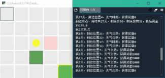

# RL-graduation-design
 reinforcement learning
Using mostly numpy and pytorch
Gym to display my enviroment

For demo, please refer to [demo for map NO.4 of cross the desert](./demonstration/第四关展示.mp4) (It's done when I finished my undergraduation, so sorry it's written in Chinese)
